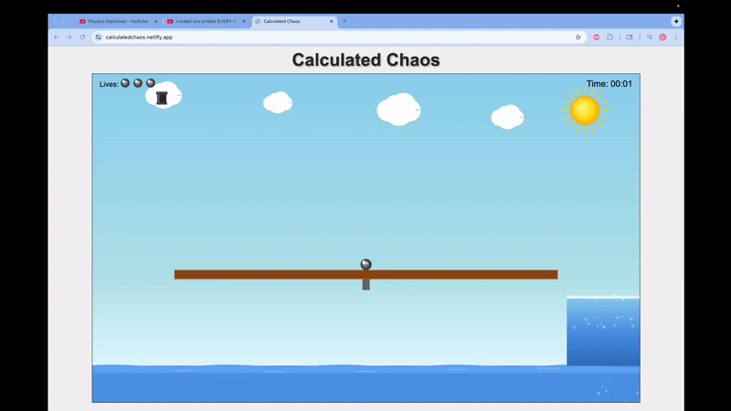

# Calculated Chaos

A physics-based browser game where you control a metallic ball on a dynamic seesaw while avoiding falling anvils.




## How to Play

**Objective**: Keep your ball alive, avoid anvils, don't fall in the water. You have 3 lives.

**Controls**:

- **Desktop**: Arrow keys to move/jump

## Quick Start

1. Open `index.html` in your browser
2. Use arrow keys (desktop) or touch controls (mobile) to play
3. Survive as long as possible!

## Game Features

- **Physics-based seesaw** that tilts with weight distribution
- **Multiple anvil types** - regular and big anvils with different impact forces
- **Water geysers** - Rising water pockets that can boost your ball to safety
- **Air jumps** - Perform up to 2 air jumps before needing to land
- **Particle effects** - Dynamic splash effects for water and anvil impacts
- **Lives system** - 3 lives with respawn mechanics
- **Survival timer** - Track how long you can survive the chaos
- **Mobile optimized** - Touch controls and responsive design
- **Smooth 60fps gameplay** with advanced collision detection
- **No installation required** - runs in any modern browser

## Files

```
index.html  # Main game file
script.js   # Game logic
style.css   # Responsive styling
```

---

**Can you master the physics and survive the anvil storm?** 🎯
